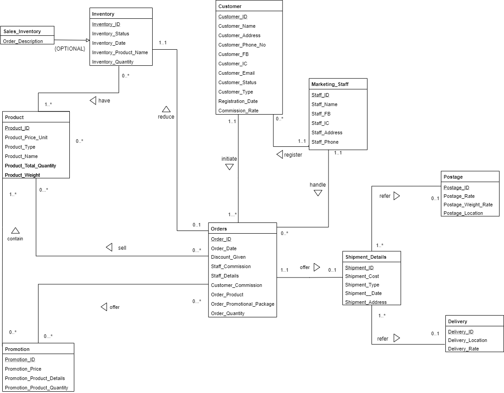
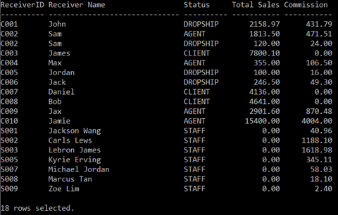
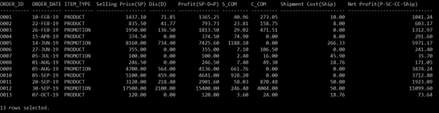
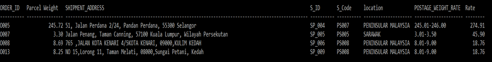
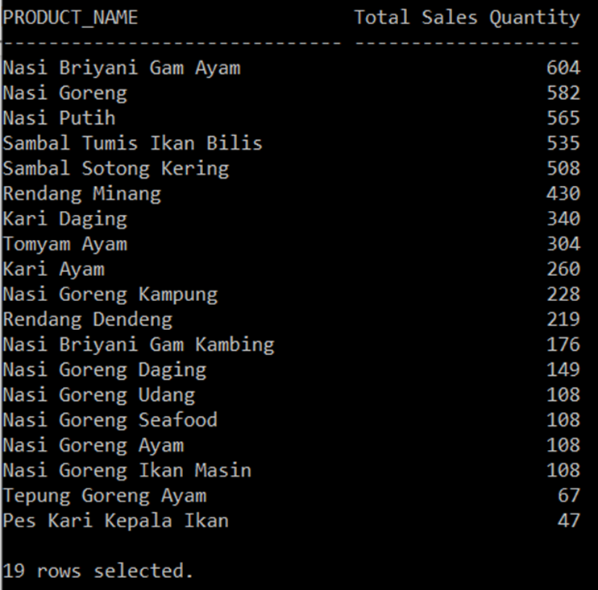
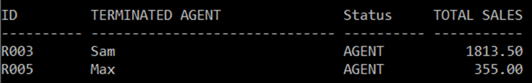
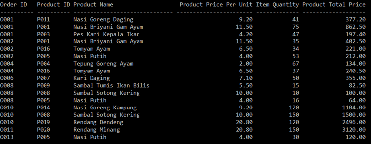

# Databases - Food Sales System

This repository contains my database assignment (Jan 2020). The system is designed for a company appointed as a stockist to manage and recruit sales agents and dropships. It is designed to streamline the sales process and efficiently manage inventory, orders, and commission payments. It includes queries to extract critical information for effective management and decision-making.

This assignment involved **(1) designing a database**, **(2) implementing flow control and logic design using Oracle**, and **(3) producing queries to extract useful information for use** . 

## **Roles and Requirements**
The company is responsible for:

- **Tracking Product Inventory**
- **Managing Purchases and Orders**
- **Handling Commission Payments** for agents and dropships
- **Direct Sales to Customers** and handle delivery service

| Feature               | Dropship                          | Agent                                |
|-----------------------|-----------------------------------|--------------------------------------|
| **Registration**      | Must register                     | Must register                        |
| **Commission**        | 20% per item sold                 | 30% per item sold                    |
| **Stock**             | Not required to keep stock        | Purchase required amount             |
| **Restock Requirement** | Not applicable                    | Minimum amount required monthly. Failure to meet for 3 consecutive months results in termination or downgrade to dropship. |
| **Postage**           | Handled by the company            | Handled by the agent                 |

#### **Direct Sales**
To motivate and reward marketing staff, the company offers commissions based on the type of customer they sell to:
  - Agents: 2%
  - Dropships: 3%
  - Clients: 20%

#### **Promotional Packages**
Available during holidays and festivals. Details provided in promotional materials.

#### **Order and Delivery** 
No shipping or delivery charges for in-store purchase. For delivery service, company-delivery is limited to klang valley areas; other locations are serviced via postal service. Charges vary by area.

## **Setup**
To set up the database:
-  Execute the Database_Setup.sql file first to create and initialize the database.
-  Once the database is set up, use the Queries.sql file to explore and execute the queries.
  
## **(1) Database Design**
Based on the requirements outlined, the database is designed as shown in the Entity-Relationship Diagram (ERD). This diagram illustrates the structure and relationships within the database.

## **(2) Implementing Design with SQL**
The flow control and logic design in the assignment were implemented using Oracle SQL. The necessary SQL setup and configurations **(create table & insert values)** can be found in the `Database_Setup.sql` file.

## **(3) Queries to Extract Useful Information**
These queries are designed to generate insights and reports necessary for effective management and decision-making, which are provided in the `Queries.sql` file. 

### **Q1: Total Sales and Commission Overview**
This query provides a comprehensive view of the total sales and commissions given to all commission receivers within a specific year. It helps the company to evaluate and compare the performance of each member based on their sales acquired. The specific year can be adjusted in the query code, and the union method is used in this query. To include data for all time periods, the date filter (`Order_date`) between `TO_DATE('01/01/2019','DD/MM/YYYY')` and `TO_DATE('31/12/2019','DD/MM/YYYY')` can be removed.

### **Q2: Profit and Expense Analysis for Orders**
This query offers insights into the profit and expenses associated with each order. It displays the selling price as (SP), the profit after discount (SP-D), and the net profit after all expenses (SP-D-C-Delivery). The profit reflects earnings before commission (C) distribution and helps determine commission amounts based on the adjusted profit. It allows some part of the discount cost bear from the commissions as the distributor have the degrees of freedom to decide the discount rate as long as it does not higher than company's benchmark. The query serves as a brief income statement for each order within a specific year. 

### **Q3: Postage Cost Calculation by Product Weight**
This query calculates the total weight of products for each relevant order to verify if the postage service cost is appropriate. It shows the total parcel weight in kg, along with the shipment address and postage location, to assess the applicable cost.

### **Q4: Annual Sales Summary by Product**
This query lists the total sales for all products within a specific year. It helps the company understand product popularity and sales distribution throughout the year. 

### **Q5: Terminated Agents with Restocking Issues**
This query identifies agents who failed to restock the minimum required amount (RM2000) for 3 consecutive months. It helps the company track and manage terminated agents who should be assigned as dropships in future.

### **Q6: Total Product Price by Order**
This query calculates the total price of all products in each order. The total price is derived from multiplying the unit price by the quantity ordered. This query aids the association/company in tracking product prices and order totals.

## Contributor
  - Vicrace Chan Jia Lin
  - Goh Way Siang
  - Milton Choo Xin Hong
  - Tan Carlson
  - Tan Eong Seang
  - Teh Liang Sean
  - Vincent Tan Siew Loong

